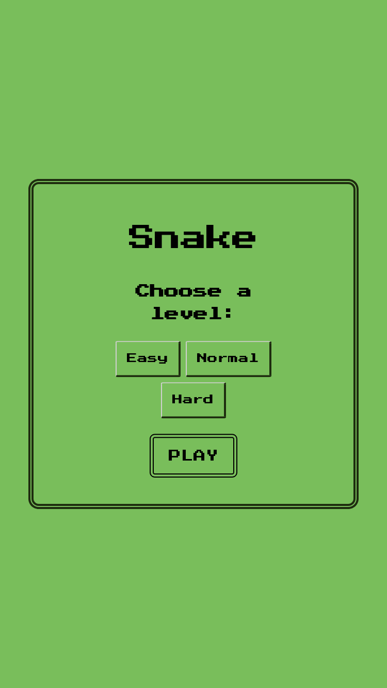
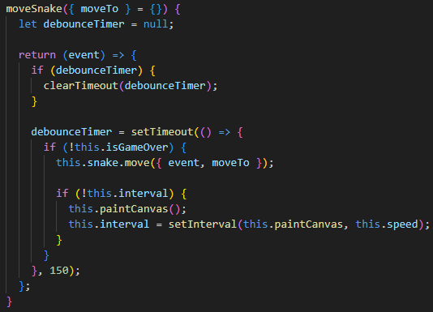

# Snake game

_Game menu_

_Play section_

_Game over_

This project was made with vanilla js and webpack

## How works?

The main file adds the rendering of the Menu page to the #app element

_src/index.js_

On the Menu page a form is created to choose a level game, by clicking the play button the function playGame is invoked. This function replaces the Menu page with the Game page and gets the necessary elements to make the game work and invoke the play method of the Game page

_src/utils/globals.js_

This play method creates and sets the game speed according to the chosen level and invokes the moveSnake method to automatically move at the start of the game

_src/pages/Game_

For the snake movement some event listeners are set and all of them invokes moveSnake

- keydown
- touchstart, touchend (Swipe on touchscreens)
- click

The moveSnake method updates which axis of canvas the snake is moving through the Snake component's move method, also updates the position and checks if the snake collides with the apple or if the game is over through its paintCanvas method, and sets a time interval depending on game speed to call paintCanvas again

_src/pages/Game_

The Snake component is based on a double linked list, where each node is a SnakeCell component and updates its position on the canvas depending of the position that its previous cell occupied, except for the head cell that updates its position by which axis the snake is moving (Snake.velocity)

_src/components/Snake_

_src/components/SnakeCell_

When the snake collides with an apple, it updates its position depending on the number of cells that the canvas has, and if it collides with some edge or with itself the game ends, showing a game over message with the highest score obtained

_src/pages/Game_

_src/pages/Apple_

_src/pages/Game_

_src/pages/Snake_

The highest score will be save in local storage, in case the user wants it to break his own record

_src/pages/Game_

