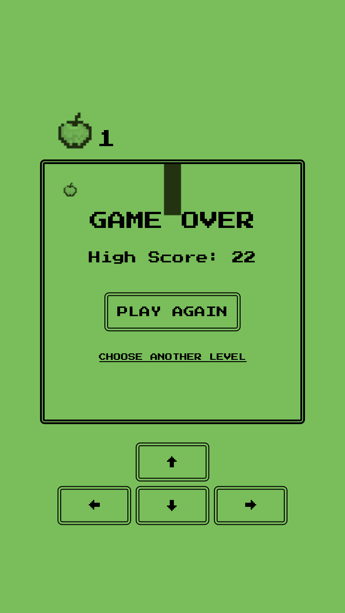
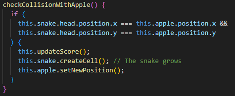

# Snake game

Welcome to the Snake Game! This project is a simple and entertaining implementation of the classic Snake game using vanilla JavaScript and webpack.

_Game menu_

_Play section_

_Game over_

This project was made with vanilla js and webpack

## How it works?

The main file (src/index.js) handles the rendering of the Menu page on the #app element.

_src/index.js_

The Menu page includes a form to select the game level. Clicking the play button invokes the playGame function, which replaces the Menu page with the Game page.

_src/utils/globals.js_

The start method in the Game page sets the game speed based on the chosen level, invokes the moveSnake method to initiate snake movement, and sets event listeners for key presses, touches, and clicks.

_src/pages/Game_

The snake movement is handled by the moveSnake method, which updates the snake's position, checks for collisions with the apple, and manages the game over conditions.

_src/pages/Game_

The Snake component is implemented as a double-linked list, where each node represents a SnakeCell component.

_src/components/Snake_

_src/components/SnakeCell_

Collisions with the apple are detected and processed in the checkCollisionWithApple method, while collisions with the edges or itself trigger the game over state.

_src/pages/Game_

_src/pages/Game_

The highest score achieved is saved in local storage, providing users with the ability to track their personal best.

_src/pages/Game_

Enjoy playing the Snake Game and aim for the highest score! Feel free to contribute or provide feedback.
